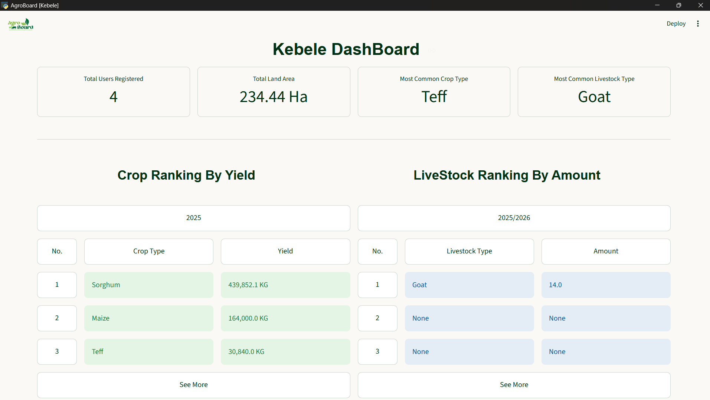
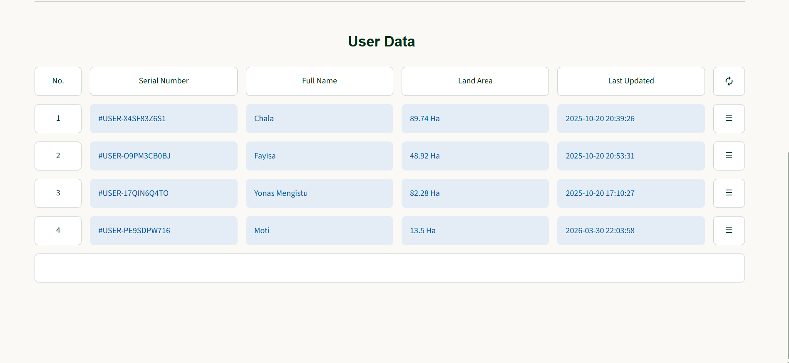

# [AgroBoard (v1): Digitizing Ethiopia's Agricultural Future](https://agroboard.streamlit.app)


# Overview

Ethiopia's Agricultural sector is heavily dependent on Paper based data collection and management
which is fragile and can easy be lost, misreported or even be minupilated

There ought to be a better way. That is **AgroBoard.**
AgroBoard is a data collection, management and reporting system that automates,
digitizes and analysis Agricultural Data. 

AgroBoard is integrated each of to Ethiopia’s agricultural hierarchy:

        Farmer -> Kebele -> Wereda(Zonal/District) -> Regional -> Federal

at the current level of development, AgroBoard is focasing on the first 2.

# Core Features (Systems):
- Weather System: Provides real-time essential Weather Data
- Data Management System: secure and safe data handling
- Analytics System: Transform raw data to useful charts and tables
- Reporting System: manages the secure and hierarchical flow of agricultural data between users and governing authorities.
- Server: ensuring centralized data management, authorized access, reliable backup and seamless connections

# System Arthitecture
- Backend: [FastAPI](https://fastapi.tiangolo.com/) + 
[PostgresSQL](https://www.postgresql.org/) + 
[Python Selve](https://docs.python.org/3/library/shelve.html)

- Frontend: [Streamlit](https://streamlit.io/)

# Tech Stack
- Language: [Python](www.python.org)

- Web Framework: [Streamlit](https://streamlit.io/)

- API: [FastAPI](https://fastapi.tiangolo.com/)

- Database: PostgreSQL for server and 
[Python Selve](https://docs.python.org/3/library/shelve.html) for local

# Installation and Setup

- Prerequisites: Python 3.0+, [PostgresSQL](https://www.postgresql.org/)
- Step 1: Clone Repository.
- Step 2 : Install Depencencies

    ```powershell
        pip install -r requirememnts.txt 
    ```
## Client app
 

- Run `agro_board_client.py` from the root directory `AgroBoard`. [How to Run](#client-app-1)

## Database and Server
- Database and  server probabilty wont work on your machine, sorry :0. This will be fixed on [AgroBoard V2](https://github.com/ItzBladeX/Agro_Board_v2_Server)

    __Follow the following if you Wish to try (Hint: DON'T, IT WONT BE PLEASENT)__

    1. Make sure you have PostgreSQL and username must match the one found under `server.py`
    2.  Make sure you have uvicorn
    
        to install Uvicorn
        
        __powershell__

        ```powershell        
        pip install uvicorn
        ```
        __Bash__
        ```bash        
        pip install "uvicorn[standard]"
        ```
    3. Launch the server and Database. [How to Run](#server)


## Kebele
- This too wont work your machine. This will be fixed on [AgroBoard V2](https://github.com/ItzBladeX/Agro_Board_v2_Kebele)
meanwhile, here are some screenshots :

    
    


    __Follow the following if you Wish to try (Hint: DON'T, IT WONT BE PLEASENT)__ 
    1. Make Sure you got the [Database and Server](#database-and-server) working.
    2. Run Kebele App. [How to Run](#kebele-app)

# How to Run

- Full Suite: The full `AgroBoard` system includes the `server`, `Client app` and `Kebele`( Kebele app wont work without server)

under the root directory `Agro_Board`, run:

## Client app

To launch on new window
```powershell
python -m agro_board_client_app.py 
```
To launch on browser
```powershell
streamlit run main.py
```
## Database and Server

```powershell
uvicorn server:app
```

## Kebele app

To launch on new window
```powershell
cd kebele
python -m agro_board_kebele_app.py 
```
To launch on browser
```powershell
streamlit run kebele_1.py
```
or
```powershell
streamlit run kebele_2.py
```
**Remember:**  Kebele app wont work if server isnt connected

# Future RoadMap
This project version development has stopped and moved on `AgroBoard V2`

- [Client App](https://github.com/ItzBladeX/Agro_Board_v2_client)
- [Server](https://github.com/ItzBladeX/Agro_Board_v2_Server)
- [Kebele App](https://github.com/ItzBladeX/Agro_Board_v2_kebele)

Major restructurs and improvement are being make.

# Contact

__If you incounter  any troubles, u may contact me on:__
- Email: itzbladex14@gmail.com / motiniguse6@gmail.com
- Github username: ItzBladeX
-

__THANK YOU :)__